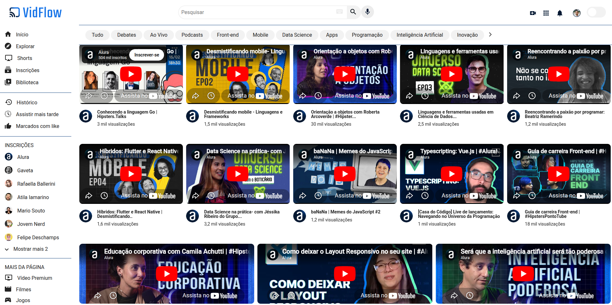

# 🎬 VidFlow



Projeto desenvolvido durante os cursos da Alura com foco em:

- Consumo de APIs
- Manipulação de dados com JavaScript
- Uso do Vite como ambiente de desenvolvimento
- Integração com API local (json-server)
- Uso de variáveis de ambiente (.env)

## 🚀 Funcionalidades

- Listagem de vídeos a partir de uma API
- Renderização dinâmica no DOM
- Filtro por categorias
- Consumo de dados via Axios
- Alternância entre ambiente local e produção

## ✔️ Técnicas e tecnologias utilizadas

- Node.js
- NPM
- Os pacotes ESLint, Prettier, JSON Server, Axios e Vite
- Vercel

## 🎨 Link do Figma

[Acesse o Figma do Vidflow](https://www.figma.com/file/a0crwitCtGmNIQW0RVIs5H/VidFlow-%7C-Curso-Js---Consumindo-dados-de-uma-API?node-id=0%3A1&mode=dev).

## 🛠️ Abrir e rodar o projeto

Após baixar ou clonar o projeto deste repositório, você precisa ter o [Node.js](https://nodejs.org/) e o [`json-server`](https://www.npmjs.com/package/json-server) instalados.

Caso não tenha o `json-server` instalado globalmente, execute o seguinte comando:

```bash
npm install -g json-server@0.17.4
```

Com o Node.js e o `json-server` instalados, execute o seguinte comando para disponibilizar a API local de vídeos:

```bash
json-server --watch backend/videos.json
```

Em seguida, abra o `index.html` no navegador e o VidFlow já pode ser visualizado!

## 🔗 Deploy

https://vidflow-vite-beta.vercel.app/

## 💡 Observações

Este projeto foi desenvolvido com fins educacionais durante os cursos da Alura.